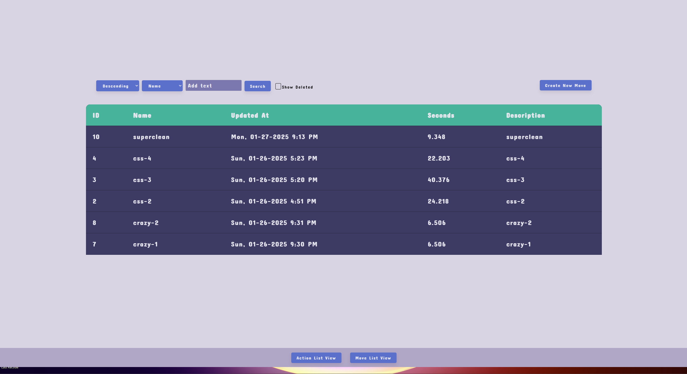
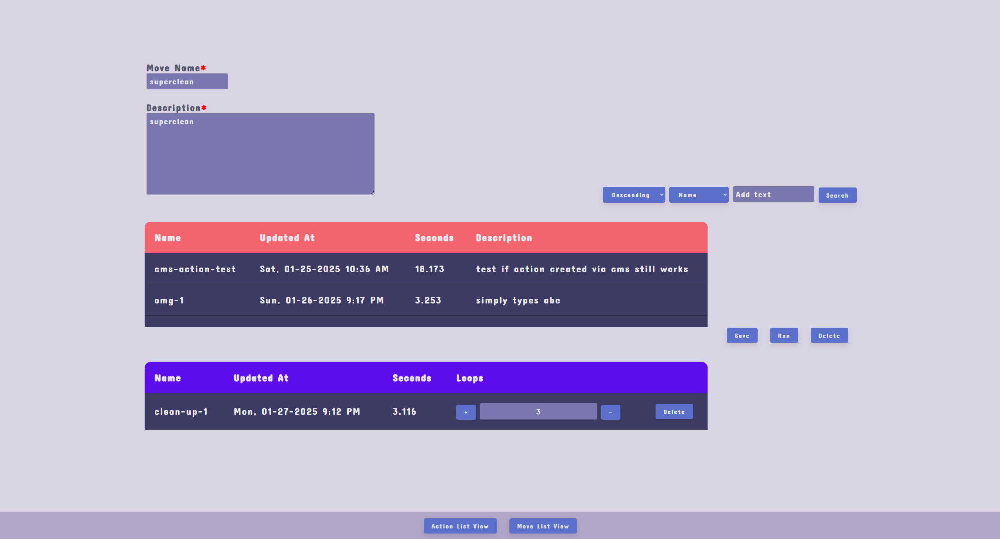

# MirrorMove CMS
This project interfaces [content-service/mirrorMove](https://github.com/MuteBard/content-service/tree/main/mirrorMove)

## Requirements
- Node.js v22.8.0

## Summary
The MirrorMove CMS is designed to create and emulate keyboard and mouse actions on the screen. Users can save a series of clicks and keyboard strokes as a single entity, known as an "action". Actions can be created, updated, deleted, and searched within the application.
Furthermore, actions can be grouped together in a "move". A move is capable of containing multiple actions, allowing for sequences of actions to be executed together. Individual actions within a move can also be looped for repetitive tasks. Moves can be created, updated, deleted, and searched within the app.

## Prerequisites

- Ensure that the following dependent services are running:
    * content-service/mirrormove is running at 8080

- Ensure that you create `env.js` at `./src/service/env.js`
```
exports.key = "CREATE YOUR OWN PASSCODE";
```

### Listing all actions

### Creating an action

### Listing all moves

### Creating a move

### Updating a move

## Running

`npm i`

`npm start`


## Video Demo
- Coming Soon
